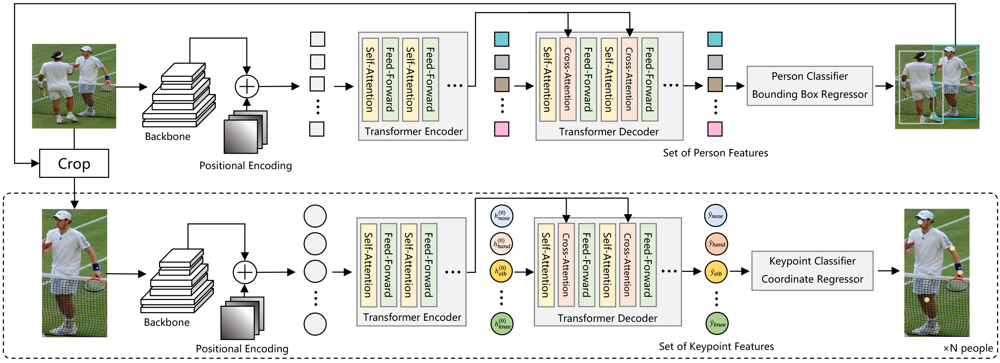
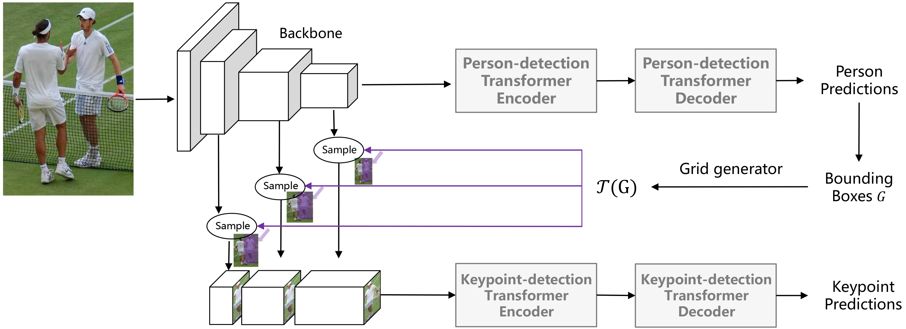

# PRTR: Pose Recognition with Cascade Transformers

## Introduction
This repository is the official implementation for [Pose Recognition with Cascade Transformers](https://openaccess.thecvf.com/content/CVPR2021/html/Li_Pose_Recognition_With_Cascade_Transformers_CVPR_2021_paper.html). It proposes two types of cascade Transformers, as follows, for pose recognition.

### Two-stage Transformers


Please refer to [README.md](two_stage/) for detailed usage of the two-stage model variant.

### Sequential Transformers


Please refer to [annotated_prtr.ipynb](sequential/annotated_prtr.ipynb) for implementation of the sequential (end-to-end) model variant.

For more details, please see [Pose Recognition with Cascade Transformers](https://openaccess.thecvf.com/content/CVPR2021/html/Li_Pose_Recognition_With_Cascade_Transformers_CVPR_2021_paper.html) by [Ke Li*](https://github.com/ricolike), [Shijie Wang*](https://github.com/Losmerengues07), [Xiang Zhang*](https://xzhang.dev), [Yifan Xu](https://yfxu.com/), [Weijian Xu](https://weijianxu.com/), and [Zhuowen Tu](https://pages.ucsd.edu/~ztu/).

## Updates
04/19/2021: Illustrative code for sequential PRTR is released  
04/24/2021: Code, logs, and pre-trained models for two-stage PRTR are released

## Citation
```
@InProceedings{Li_2021_CVPR,
    author    = {Li, Ke and Wang, Shijie and Zhang, Xiang and Xu, Yifan and Xu, Weijian and Tu, Zhuowen},
    title     = {Pose Recognition With Cascade Transformers},
    booktitle = {Proceedings of the IEEE/CVF Conference on Computer Vision and Pattern Recognition (CVPR)},
    month     = {June},
    year      = {2021},
    pages     = {1944-1953}
}
```

## License
This repository is released under the Apache License 2.0. License can be found in [LICENSE](LICENSE) file.

## Acknowledgments
This project is based on the following open source repositories, which greatly facilitate our research.
- Thanks to [DETR](https://github.com/facebookresearch/detr) for the implementation of [Detection Transformer](https://arxiv.org/abs/2005.12872)
- Thanks to [HRNet-Human-Pose-Estimation](https://github.com/HRNet/HRNet-Human-Pose-Estimation) for the training and evaluation pipeline
- Thanks to [HRNet-Image-Classification](https://github.com/HRNet/HRNet-Image-Classification) for [HRNet](https://arxiv.org/abs/1908.07919) backbone implementation
